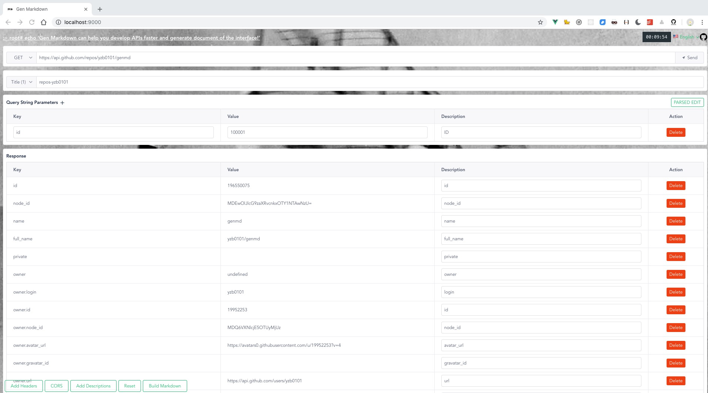

# Gen Markdown

> Gen Markdown 能够帮你调试接口并且生成文档！



[English](README.md)

## 项目配置

> 首次运行项目需要安装依赖包

```
yarn
```

### 开发

```
yarn dev
```

### 编译
```
yarn build
```

### 测试
```
yarn  test
```

### 审查或修复代码
```
yarn lint
yarn lint --fix
```